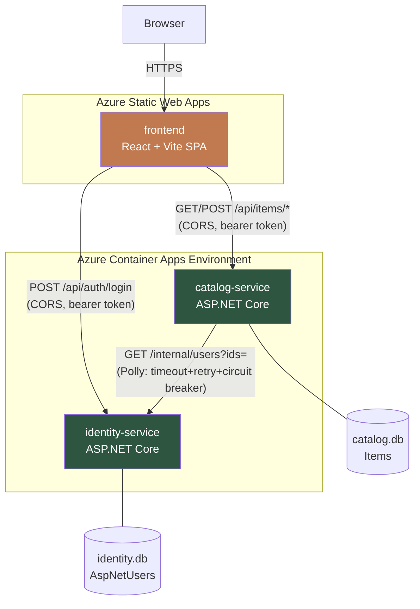
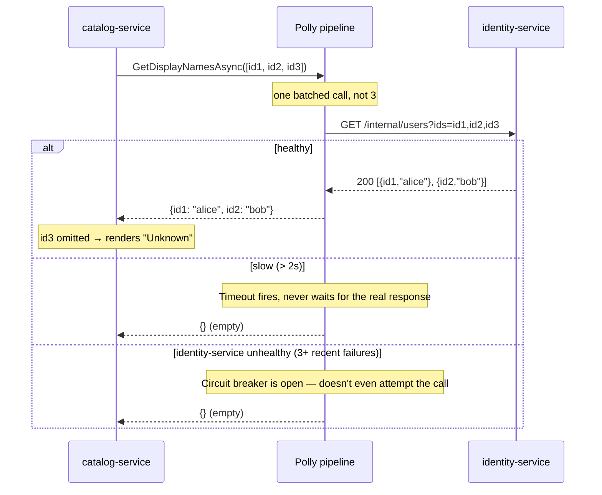
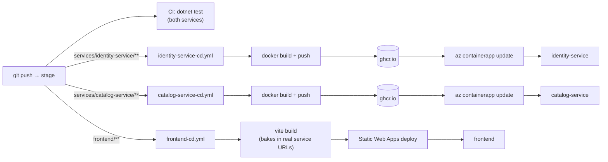

# AcmeCatalog

## What this is

A small item catalog app used as a practice/portfolio vehicle for real
microservices architecture, real test-double theory (mocks, stubs, spies,
resilience), and a real CI/CD pipeline — not a scaffolded demo. It went
through three architectural eras in the same repo: a server-rendered MVC
app, a React SPA bolted onto that same backend, and — the current
state — two independently deployed backend services plus a standalone
frontend, each with their own database, deployed on their own schedule.

The split wasn't done to give a testing tool something to point at. It was
done because a monolith can't produce genuine inter-service behavior —
there's nothing real to mock, no real contract to drift, no real resilience
to test — and that was the actual point of doing this the hard way.

## Architecture



Three independently deployable units. **Auth is fully decoupled**:
catalog-service validates JWTs itself using a signing key shared via config
— it never calls identity-service to check a token. The one arrow between
the two services exists for a different, real reason (below), and that's
deliberate: two services that never talk to each other at runtime would be
just as useless to test as the monolith was.

### Why catalog-service calls identity-service at all

catalog-service tracks who created each item (`CreatedByUserId` — just an
opaque id, no shared table, no join). To show "Added by `<username>`" in
the catalog, it resolves a batch of those ids to display names by calling
identity-service's own internal endpoint:



This is the one genuine service-to-service dependency in the system, and
it's guarded by a real resilience policy (`AddIdentityServiceClient` in
`catalog-service/Services/`), not a bare try/catch:

1. **Timeout (2s)** — a *slow* identity-service has to be treated differently
   from a *dead* one; without this, a hanging call would hang every catalog
   page load along with it.
2. **Retry (1 attempt, 200ms delay)** — absorbs a single transient blip.
3. **Circuit breaker (opens after 3 failures in 10s, stays open 15s)** —
   once identity-service is clearly unhealthy, stop hammering it on every
   catalog request; fail fast locally instead.

The `ShouldHandle` predicate covers both thrown exceptions *and* non-success
HTTP status codes — the first version of this only handled exceptions,
which meant a real 500 from identity-service silently never triggered retry
or the breaker at all. Caught by `IdentityClientResilienceTests` (WireMock.Net
standing in for identity-service, asserting on real elapsed time — a 6-second
injected delay against a 2-second timeout has to come back in well under
4 seconds, not almost-6), not by inspection.

Everywhere else, failure to resolve a name just renders `"Unknown"` — never
a 500 to the browser. Items with no creator at all (seeded data, from before
this feature existed) show the same fallback, with no network call at all.

## Services

### identity-service

Owns `AspNetUsers`/`AspNetRoles` and JWT issuance. Nothing else.

| Endpoint | Auth | Purpose |
|---|---|---|
| `POST /api/auth/login` | Public | Returns `{ token, expiresAtUtc, username }` |
| `POST /api/auth/register` | Public | Creates a user, returns a token immediately (JWT is stateless — no session to establish) |
| `GET /api/auth/me` | Bearer | Reads username/email straight from the validated token's claims |
| `GET /internal/users?ids=` | **None** | The one thing catalog-service calls. Batched; unmatched ids are silently omitted, not errored. *(A real gap, not glossed over: in production this would be restricted at the network layer or behind a service-to-service credential, neither of which is set up here.)* |
| `GET /health` | Public | Real EF Core connectivity check, not a static "OK" |

JWTs: HMAC-SHA256, claims `sub`/`unique_name`/`email`/`jti`, 60-minute expiry,
signing key shared with catalog-service via config (Azure Container Apps
secret in production, `appsettings.json` locally — the local one is a
labeled demo key, never used for the deployed instance).

Seeded test user: **`testuser` / `Test123!`**

### catalog-service

Owns `Items`. Validates JWTs it didn't issue, using nothing but the shared
signing key.

| Endpoint | Auth | Purpose |
|---|---|---|
| `GET /api/items` | Public | Search/filter/sort (`term`, `category`, `sort`, `minPrice`, `maxPrice`) |
| `GET /api/items/{id}` | Public | Single item |
| `GET /api/items/categories` | Public | Distinct category list |
| `POST /api/items` | Bearer | Create — `CreatedByUserId` set from the token's `sub` claim |
| `PUT /api/items/{id}` | Bearer | Update |
| `DELETE /api/items/{id}` | Bearer | Delete |
| `POST /api/items/{id}/image` | Bearer | Multipart upload; returns an absolute `imageUrl` (the frontend is cross-origin now, a relative path would resolve against the wrong host) |
| `GET /api/items/export` | Public | CSV download |
| `PUT /api/items/reorder` | Bearer | Drag-and-drop persistence |
| `GET /Items/ImagePreview/{id}` | Public | Standalone HTML document (not JSON) embedded as the Quick View modal's iframe `src`. Hand-escapes `Name`/`ImageUrl` via `WebUtility.HtmlEncode` — this isn't Razor, so nothing does that automatically, and skipping it would be a stored-XSS hole |
| `POST /api/test/reset` | Public, **Development-only** | Reseeds the catalog; backs Cypress's `cy.resetDb()`. Returns 404 outside Development by construction, not just by convention |
| `GET /health` | Public | |

`Item`: `Id`, `Name`, `Price`, `Description`, `Category`, `ImageUrl`,
`SortOrder`, `DateAdded`, `CreatedByUserId` (nullable, opaque string —
identity-service's id format, never a foreign key into anything since
there's nothing in this database for it to reference). Seeded with 10 items
across 5 categories.

### frontend

React 19 + Vite + React Router, a fully standalone static site — nothing
about it assumes it's hosted by either backend. Calls both services
directly over CORS using env-configured base URLs
(`VITE_IDENTITY_SERVICE_URL`, `VITE_CATALOG_SERVICE_URL`), baked in at
build time.

Auth is a bearer token in `localStorage` (`AuthContext.tsx`), never a
cookie — which is *why* CORS on both services can be a plain allow-list with
no credentials mode, one less thing to get wrong across three origins.

## Testing

126 tests across the stack, all real, none decorative:

| Layer | Where | What it actually proves |
|---|---|---|
| Backend unit | `tests/CatalogService.Tests/ItemEnricherTests.cs` | Real `ItemEnricher` logic against a **mocked** `IIdentityClient` (Moq) — batches distinct ids into one call, falls back to "Unknown" on a miss or a null creator, all without touching HTTP |
| Backend resilience | `tests/CatalogService.Tests/IdentityClientResilienceTests.cs` | The *actual* Polly pipeline (`AddIdentityServiceClient`, not a copy) against **WireMock.Net** — real elapsed time for the timeout case, real repeated failures to trip the circuit breaker, verified by counting requests that actually reached the stub server |
| Backend CRUD | `tests/CatalogService.Tests/ItemServiceTests.cs` | Search/sort/filter/reorder against EF Core InMemory |
| Backend integration | `tests/IdentityService.Tests/AuthApiTests.cs` | Real ASP.NET Identity stack (not mocked — `UserManager`/`SignInManager` aren't practical to mock) via `WebApplicationFactory` against a throwaway SQLite file per test |
| Frontend e2e | `frontend/cypress/e2e/**` (74 tests) | Full browser flows against the real running services — login, CRUD, drag-reorder, image upload, CSV export, cookie consent, a11y (axe) |
| Frontend component | `frontend/cypress/src/**/*.cy.tsx` (18 tests) | Components in isolation, mounted with the app's real CSS (component tests silently had *no* CSS import until this was found via a genuinely-flaky backdrop-click test) |

`npm test`-equivalents: `dotnet test AcmeCatalog.slnx` (backend),
`npx cypress run` / `npx cypress run --component` (frontend, from `frontend/`).

## CI/CD



Three independent pipelines, path-filtered so each service ships on its own
— the actual point of the split, not just its deployment target. Images go
to **GitHub Container Registry**, not Azure Container Registry: functionally
identical for this purpose, but ACR's Basic tier runs ~$5/month against
this project's Azure-for-Students credit for something GHCR does free.

## Infrastructure

- **Azure Container Apps** (`acmecatalog-env`, Consumption profile) —
  `identity-service` and `catalog-service`, each 0.25 vCPU / 0.5Gi,
  `min-replicas: 0` (scale to zero when idle). A demo-scale app comfortably
  fits inside Container Apps' always-free allowance (180,000 vCPU-seconds +
  2M requests/month) — real cost here is $0, not just "should be low."
- **Azure Static Web Apps** (Free tier) — the frontend.
- The original single App Service this app used to run on has been deleted
  — fully superseded, and it was serving the retired monolith by the time
  it went.

**Known, deliberate tradeoff**: neither container app has a persistent
volume, so SQLite data resets on every scale-to-zero cycle or redeploy.
Both services reseed automatically on startup when their database is
empty, so this is invisible in practice for a demo — real user-created data
wouldn't survive it, which would matter for an actual product and doesn't
for this one. Not solved with more infrastructure on purpose; Azure Files
mounting is a real, known next step if this ever needed to hold real data.

## Running it locally

Three processes, three terminals:

```bash
# identity-service — http://localhost:5301
dotnet run --project services/identity-service

# catalog-service — http://localhost:5302 (needs identity-service running
# for the enrichment feature to resolve real names; degrades to "Unknown"
# without it, doesn't fail)
dotnet run --project services/catalog-service

# frontend — http://localhost:5173, reads .env.development for the two
# service URLs above
cd frontend && npm run dev
```

```bash
# backend tests
dotnet test AcmeCatalog.slnx

# frontend tests (from frontend/)
npx cypress run              # e2e — needs both services running
npx cypress run --component  # component — standalone, no backend needed
```

## Known gaps, named rather than hidden

- **`frontend/src/types.ts` is hand-synced** with both services' DTOs — a
  comment says so, but nothing enforces it. Renaming a backend field breaks
  the frontend silently at runtime, not at compile time. Generating this
  from each service's OpenAPI spec (`/swagger/v1/swagger.json`, already
  exposed by both) would close this; not done yet.
- **`GET /internal/users` has no access restriction** beyond "it's an
  endpoint that exists." A real deployment would put it behind network
  policy or a service-to-service credential.
- **No API gateway** — the frontend calls both services directly. A BFF
  (YARP would be the idiomatic .NET choice) is a natural next step if a
  single frontend-facing origin or more contract-testing surface is wanted
  later.
- **No contract testing yet.** The plan (Pact, real boundaries: catalog↔identity
  first since it's genuine backend-to-backend, then each frontend↔service
  pair, published to a real PactFlow broker rather than files shuffled
  between CI jobs) is written but not started.
